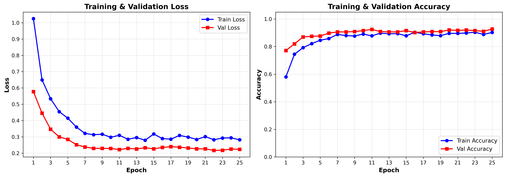
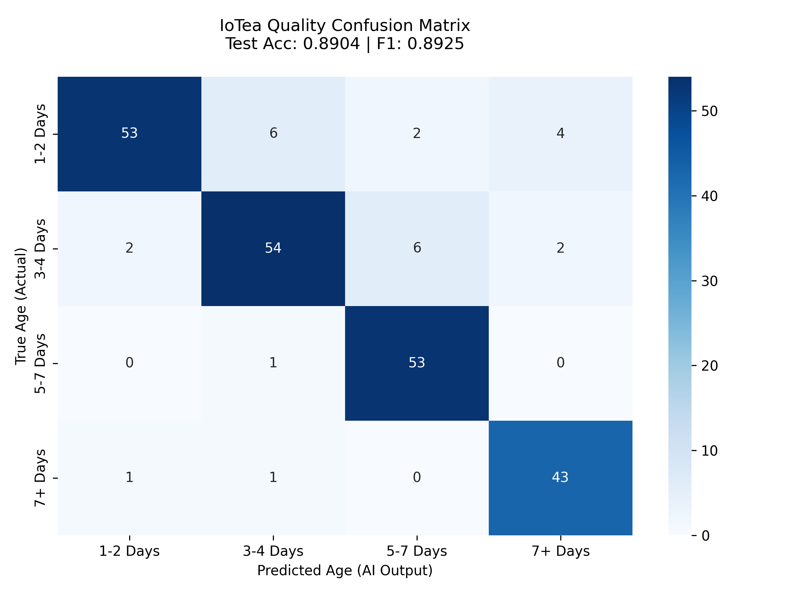

# 🍵 AIoTea: Tea Leaf Age & Quality Classification

[](https://pytorch.org/)
[](https://www.python.org/)

An AIoT-enabled Tea Withering Decision Support System developed for the **SLIOT Competition** by Team **IoTea**. 

This repository contains the Machine Learning (AI) component of the project. It classifies the age of tea leaves during the withering process to estimate the optimal time until the leaves reach their ideal state for processing.

## 📌 Project Overview
Proper tea withering directly impacts leaf strength, aroma development, and final market value. This ML pipeline acts as the visual brain of our IoT edge device, observing leaf conditions over time to provide clear, data-driven decision guidance to factory technicians.

**Key Objectives:**
1. Classify tea leaves into 4 age-based quality categories.
2. Output a heuristic estimation of "Time Until Ideal" (Targeting the T2 stage).

## 📊 The Dataset
We utilize the **TeaLeafAgeQuality** dataset. The pipeline is custom-built to parse YOLO-formatted bounding box annotations (`.txt`) and adapt them for a strict Image Classification task, aggressively handling human annotation errors and class imbalance.

* **T1 (1-2 days):** Highest quality (Wait ~24-48 hours)
* **T2 (3-4 days):** Ideal quality (HARVEST NOW)
* **T3 (5-7 days):** Average/Below-average (Overdue)
* **T4 (7+ days):** Unsuitable (Discard)

## 🧠 Model Architecture
To ensure the model is lightweight enough for edge IoT devices (Raspberry Pi/Jetson) while maintaining high accuracy, we utilize an **EfficientNet-B0** backbone.

* **Backbone:** `efficientnet_b0` (via `timm`), initialized with ImageNet pre-trained weights.
* **Classifier Head:** Custom fully-connected layer replacing the default 1000-class ImageNet head.
* **Regularization:** Heavy data augmentation via `Albumentations` (Color Jitter, Flips, Rotations) and a `Dropout(0.5)` layer before the final dense layer to prevent overfitting on factory conditions.
* **Optimizer:** AdamW with Weight Decay (`1e-2`).

## 📈 Results & Performance
The model was evaluated on a strictly held-out test set using proper `scikit-learn` metrics, ensuring real-world reliability.

* **Final Test Accuracy:** ~89.04%
* **Final Test Macro F1-Score:** ~89.25%

### Training Curves
*The model demonstrates excellent generalization, with Validation Accuracy tightly tracking Training Accuracy without severe overfitting.*


### Confusion Matrix
*The model perfectly balances predictions across all 4 classes, with minor, biologically expected confusion occurring only between adjacent age brackets (e.g., T2 vs T3).*


## 📂 Repository Structure
```text
AIoT_teaLeafAgeQuality/
├── data/                   # (Git Ignored) Dataset directory
├── src/                    # Source code
│   ├── data/
│   │   └── dataloader.py   # Dataset class, transforms, and loader logic
│   ├── model/
│   │   ├── model.py        # EfficientNet-B0 architecture
│   │   └── train.py        # Training and validation step logic
│   └── utils/
│       └── plot.py         # Matplotlib & Seaborn visualization scripts
├── main.py                 # Main execution script and hyperparameters
├── requirements.txt        # Python dependencies
└── README.md
```

## 🚀 Setup & Installation

### 1. Clone the repository:
Bash

git clone [https://github.com/YOUR_USERNAME/AIoT_teaLeafAgeQuality.git](https://github.com/YOUR_USERNAME/AIoT_teaLeafAgeQuality.git)
cd AIoT_teaLeafAgeQuality

### 2. Install dependencies:
Bash

pip install torch torchvision torchaudio --index-url [https://download.pytorch.org/whl/cu118](https://download.pytorch.org/whl/cu118)
pip install timm albumentations opencv-python pandas numpy matplotlib seaborn scikit-learn tqdm

### 3. Download Data (Requires Kaggle API):
```
Bash

# Ensure you have your kaggle.json configured
kaggle datasets download -d fahadbd/tealeafagequality --unzip -p data/
```

### 4. Train the Model:
```
Bash

python main.py
```